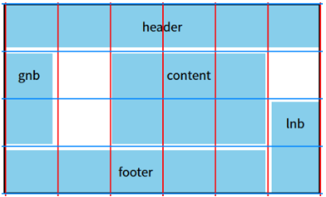
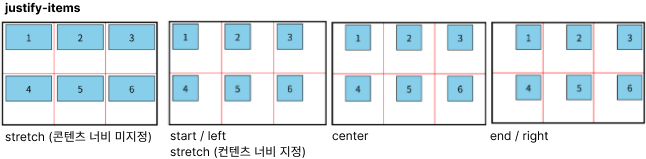
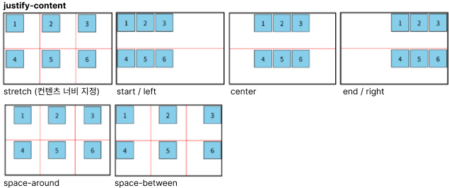
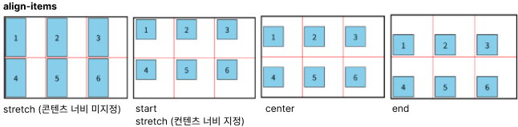
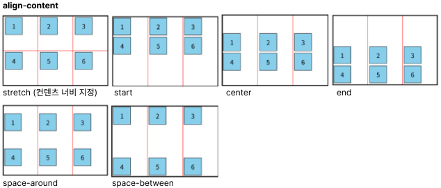
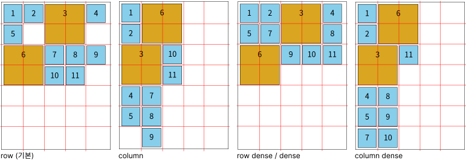
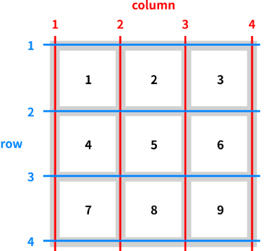
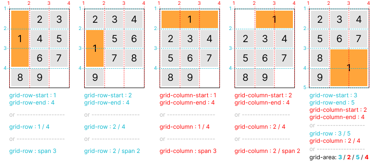
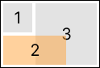
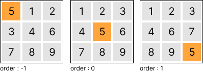

# Index

1. [부모요소 GRID의 속성](#부모요소-grid의-속성)
    - display
    - grid, grid-template-columns / row / areas
    - grid-gap, grid-column / row-gap
    - justify / align - items / content
    - grid-auto-flow

1. [자식요소 GRID의 속성](#자식요소-grid의-속성)
    - justify / align - self
    - grid-area, grid-row, grid-column, grid-row-start / end, grid-column-start / end
    - z-index, order

<br>

----------------------------------------------------------------------------
# 부모요소 GRID의 속성

|속성|속성값|설명|
|:--|:--|:--|
|[display](#display)|grid, inline-grid|그리드 정의|
|grid-template-columns|auto, 단위, 1fr, %, <br/>repeat(n, 단위), repeat(auto-fill/fit, 단위),<br> min-content, minmax(최소값, 최대값)|그리드 셀 너비 정의|
|grid-template-rows|auto, 단위, 1fr, %, <br/>repeat(n, 단위), repeat(auto-fill/fit, 단위),<br> min-content, minmax(최소값, 최대값)|그리드 셀 높이 정의|
|[grid](#grid-template-columns-gird-template-rows-grid)|너비 / 높이|그리드 셀 너비/높이 정의 (축약)|
|[grid-template-areas](#grid-template-areas)|'이름' '이름'|자식요소의 'grid-area'에서 정의한 이름을 영역으로 지정|
|grid-column-gap|단위|그리드 좌우 간격|
|grid-row-gap|단위|그리드 상하 간격|
|[grid-gap](#grid-column-gap-grid-row-gap-grid-gap)|단위, <br/> 단위 단위|그리드 상하좌우 간격(축약), <br> 그리드 상하/좌우 간격|
|[justify-items](#justify-items-align-items-justify-content-align-content)|stretch (기본), <br>start/left, center, end/right|그리드 셀 너비 기준으로 자식 수평 정렬|
|align-items|stretch (기본), <br>start, center, end|그리드 셀 높이 기준으로 자식 수직 정렬|
|justify-content|stretch (기본), <br>start/left, center, end/right, <br>space-around, space-between|그리드(부모) 기준으로 자식 수평 정렬|
|align-content|stretch (기본), <br>start, center, end,<br>space-around, space-between|그리드(부모) 기준으로 자식 수직 정렬|
|[grid-auto-flow](#grid-auto-flow)|row(기본), column, dense|자식요소 배치 알고리즘 처리|
<br>

---

### display
- ```grid``` : grid 로 정의
- ```inline-grid``` : 인라인 요소의 grid로 정의
<br>

---

### grid-template-columns, gird-template-rows, grid
- gird 셀 개수 지정

#### grid-template-columns, gird-template-rows
- ```auto``` (자동), ```단위``` (크기), ```%``` (퍼센트) 로 셀 너비/높이 지정
    - ```50px auto``` : 셀을 2개로 나누고 각 너비/높이를 50px, 자동으로 지정
    - ```30px 30% auto``` : 셀을 3개로 나누고 각 너비/높이를 30px, 30%, 자동으로 지정
- ```fr``` : 비율로 셀 너비/높이 지정
    - ```1fr 1fr``` : 셀을 2개로 나누고 각 너비/높이를 1/2로 지정
    - ```1fr 3fr 2fr``` : 셀을 3로 나누고 각 너비/높이를 1/6, 3/6, 2/6으로 지정
    - ```100px 1fr 1fr``` : 셀을 3로 나누고 각 너비/높이를 100px, (나머지 여백의) 1/2, 1/2으로 지정
- ```repeat(n, 단위)``` : 셀을 n으로 나누고 각 너비/높이를 '단위'로 지정
    - ```repeat(3, 1fr)``` : 셀을 3개로 나누고 각 너비/높이를 1/3으로 지정
    - ```100px repeat(2, 1fr)``` : 셀을 3개로 나누고 각 너비/높이를 100px, (나머지 여백의) 1/2, 1/2으로 지정
    - ```repeat(auto-fill, 100px)``` : 셀 너비/높이를 100px를 지정하면서 부모 너비/높이에 맞춰 개수가 자동으로 계산됨 (여백O)
    - ```repeat(auto-fit, 100px)``` : 셀 너비/높이를 100px를 지정하면서 부모 너비/높이에 맞춰 개수가 자동으로 계산됨 (여백X)
- ```min-content``` : 셀 너비/높이를 최소로 지정 (이미지 삽입 활용)
    - ```min-content 1fr 1fr``` : 셀을 3로 나누고 각 너비/높이를 최소값, (나머지 여백의) 1/2, 1/2로 지정
- ```minmax(최소값, 최대값)``` : 셀 너비/높이 값을 '최소~최대'로 지정
    - ```200px minmax(100px, auto)``` : 셀을 2개로 나누고 각 너비/높이를 200px, '100px~자동'으로 지정
    - ```repeat(auto-fill, minmax(min-content, 100px))``` : 각 너비/높이를 컨텐츠의 '최소값~100px'으로 지정하면서 부모 너비/높이에 맞춰 개수가 자동으로 계산됨 (여백X)

#### grid
- ```너비/높이``` : 그리드 너비/높이 동시 지정 (축약형)
    - ``` 100px auto / repeat(3, 1fr)``` : 셀의 행을 2로 나누고 각각 100px, 자동값을 지정
<br>

---

### grid-template-areas
- 자식요소 "grid-area : 이름"과 같이 사용
- 자식요소의 'grid-area'에서 정의한 이름을 영역으로 지정 (붙어 있으면 병합처럼 처리)
- '따옴표'가 1행이며, 빈칸은  한글, 숫자, 영어로 표현이  가능 (보통 . 으로 표시)
```css
/* 부모 */
.parent{
    grid-template-areas : 
        'header header header  header  header  header'
        'gnb    .      content content content .'
        'gnb    .      content content content lnb'
        'footer footer footer  footer  footer  lnb';
}
/* 자식 */
.header{ grid-area: header; }
.content{ grid-area: content; }
.gnb{ grid-area: gnb; }
.lnb{ grid-area: lnb; }
.footer{ grid-area: footer; }
```


<br>

---

### grid-column-gap, grid-row-gap, grid-gap
- 그리드 셀 간격 지정

#### grid-column-gap, grid-row-gap
- ```단위``` : 그리드 열 / 행의 간격(gap) 지정
    - ```10px``` : 그리드 열/행의 간격을 10px로 지정

#### grid-gap
- ```단위``` : 그리드 간격(gap) 지정 (축약형)
    - ```10px``` : 그리드 열과 행의 간격을 10px로 지정
    - ```10px 20px``` : 상하(row) 간격은 10px, 상하(col) 간격은 20px
<br>

---

### justify-items, align-items, justify-content, align-content
- 셀 내부 콘텐츠 정렬
- -items : 셀 기준으로 정렬, 컨텐츠가 1줄 일때 적용
- -content : 부모 기준으로 정렬, 컨텐츠가 여러줄 일때 적용

#### justify-items (셀 기준으로 수평 정렬)
- ```stretch``` : (기본) 크기 미지정시 auto로 정렬 (좌우 가득 참)
- ```start```, ```left``` : 왼쪽 정렬
- ```center``` : 가운데 정렬
- ```end```, ```right``` : 오른쪽 정렬<br/>


#### justify-content (부모 기준으로 수평 정렬)
- ```stretch``` (기본), ```start/left``` (왼쪽), ```center``` (가운데), ```end/right``` (오른쪽)
- ```space-around``` : 양쪽 수평 정렬
- ```space-between``` : 양쪽 끝 수평 정렬<br/>


#### align-items (셀 기준으로 수직 정렬)
- ```stretch``` : (기본) 크기 미지정시 auto로 정렬 (상하 가득 참)
- ```start``` : 위쪽 정렬
- ```center``` : 가운데 정렬
- ```end``` : 아래쪽 정렬<br/>


#### align-content (부모 기준으로 수직 정렬)
- ```stretch``` (기본), ```start``` (위쪽), ```center``` (가운데), ```end``` (아래쪽)
- ```space-around``` : 양쪽 수직 정렬
- ```space-between``` : 양쪽 끝 수직 정렬<br/>


<br>

---

### grid-auto-flow
- 배치하지 않은 자식요소를 배치 정렬
- ```row``` : (기본) 행 우선 배치 알고리즘 처리
- ```column``` : 열 우선 배치 알고리즘 처리
- ```dense / row dense``` : 빈영역 채우면서 행 우선 배치 알고리즘 처리
- ```column dense``` : 빈영역 채우면서 열 우선 배치 알고리즘 처리<br>


<br>

----------------------------------------------------------------------------

# 자식요소 GRID의 속성

| 속성 | 속성값 | 설명 |
| :-- | :-- | :-- |
| [justify-self](#justify-self-align-self) | stretch, start/left, center, end/right | 자식 개별 수평 정렬 |
| align-self | stretch, start, center, end | 자식 개별 수직 정렬 |
| grid-row-start | 로우 라인 기준 숫자 | 라인 기준으로 가로(row) 시작 위치|
| grid-row-end | 로우 라인 기준 숫자 | 라인 기준으로 가로(row) 종료 위치|
| [grid-row](#grid-row-start-grid-row-end-grid-row) | 라인 / 라인, <br> span 확장 개수 | 라인 기준으로 가로(row) 시작/종료 위치 (축약), <br> span : 지정 위치 기준으로 가로 확장|
| grid-column-start | 컬럼 라인 기준 숫자 | 라인 기준으로 세로(col) 시작 위치|
| grid-column-end | 컬럼 라인 기준 숫자 | 라인 기준으로 세로(col) 종료 위치
| [grid-column](#grid-column-start-grid-column-end-grid-column) | 라인 / 라인, <br> span 확장 개수 | 라인 기준으로 세로(col) 시작/종료 위치 (축약), <br> span : 지정 위치 기준으로 세로 확장|
| grid-area | row 시작 / col 시작 / row 끝 / col 끝, <br> 이름 | [grid-column/row 축약](#grid-area-영역-지정), <br> [부모 요소의 grid-template-area에서 사용할 이름 지정](#grid-area-이름-지정)|
| [z-index](#z-index) | 숫자 | 레이어 순서 |
| [order](#order) | 숫자 (음수/0/양수) | 정렬 순서 (작은 숫자일 수록 좌측 상단 정렬) |
<br>

---

### justify-self, align-self
- 부모가 지정한 정렬과 상관 없이 자식이 독립적으로 정렬

#### justify-self (수평 정렬)
- ```stretch``` : (기본) 크기 미지정시 auto로 정렬 (좌우 가득 참)
- ```start```, ```left``` : 왼쪽 정렬
- ```center``` : 가운데 정렬
- ```end```, ```right``` : 오른쪽 정렬<br/>

#### align-self (수직 정렬)
- ```stretch``` : (기본) 크기 미지정시 auto로 정렬 (상하 가득 참)
- ```start``` : 위쪽 정렬
- ```center``` : 가운데 정렬
- ```end``` : 아래쪽 정렬

<br>

---

### gird 영역 지정 "컬럼/로우 라인 기준"



#### grid-row-start, grid-row-end, grid-row
- 라인 기준으로 가로(row) 시작 위치와 종료 위치 (영역 지정)
- 상하 확장

#### grid-column-start, grid-column-end, grid-column
- 라인 기준으로 세로(col) 시작 위치와 종료 위치 (영역 지정)
- 좌우 확장

#### grid-area (영역 지정)
- row 시작 / col 시작 / row 끝 / col 끝 
- "grid-column-start, grid-column-end, grid-column", "grid-row-start, grid-row-end, grid-row"의 축약형<br>


<br/>

---

#### grid-area (이름 지정)
- 부모요소의 [grid-template-area](#grid-template-areas)에서 사용할 이름 지정
- 한글, 숫자, 영어 모두 사용 가능
- 클래스명, 태그명과 중복되어도 상관 없음

<br/>

---

### z-index
- 레이어 순서 (숫자 : 음수/0/양수)
```
.parent div:nth-child(3){
  grid-area: 1 / 2 / 3 / 4;
  z-index: 0;
}
.parent div:nth-child(2){
  grid-area: 2 / 1 / 3 / 3;
  opacity: .6;
  z-index: 1
}
```

<br/>

---

### order
- 정렬 순서 (숫자 : 음수/0/양수)
- 작은 숫자일 수록 좌측 상단 정렬<br>

<br/>