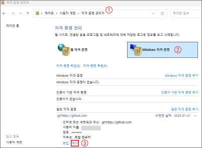

## Index

**1. 시작**
1. [git 설치](#git-설치)
1. [git 버전 및 설치 확인](#git-버전-및-설치-확인)
1. [git 시작 및 등록](#git-시작-및-등록)
    - [git 시작](#git-시작)
    - [git 옵션 설정](#git-옵션-설정)
    - [git 이름 및 이메일 등록 및 변경](#git-이름-및-이메일-등록-및-변경)
    - [git 등록 정보 확인](#git-등록-정보-확인)
    - [git 로그](#git-로그)

<br/>

**2. VS Code & Git 명령어**

1. [git 상태 확인](#git-상태-확인)
1. [git 버전관리 지정](#git-버전관리-지정)
1. [git 커밋](#git-커밋)
1. [git 원격브랜치 연결](#git-원격브랜치-연결)
1. [git 푸시 (업로드)](#git-푸시-업로드)
1. [git 풀 (다운로드)](#git-풀-다운로드)
1. [git 버전 되돌리기 (Reset)](#git-버전-되돌리기-reset)
1. [github 프로젝트 복사](#github-프로젝트-복사)


<br/>

**3. VS Code & Git 프로세스**

1. [github 수정사항 업로드(푸시)](#github-수정사항-업로드푸시)
1. [github 계정 변경](#github-계정-변경)

<br>

---------------------------------------------------
# 1. 기초

### git 설치

1. git 설치 (검색 : git) <https://git-scm.com/>
    - OS에 맞게 설치 (window)

2. github 회원가입 <https://github.com/>

<br>

---------------------------------------------------
### git 버전 및 설치 확인
[cmd] or [VS code Terminal]
```
git --version
```
- 설치된 git 버전이 나옴
- ex) git version 2.32.0.windows.2

<br>

---------------------------------------------------

### git 시작 및 등록

#### git 시작
```
git init
```
- 깃 시작 (git 파일 생성)
- 현재 프로젝트에서 변경사항 추적(버전관리)을 시작하겠다라고 선언

<br>

#### git 옵션 설정
- window
  ```
  git config --global core.autocrlf true
  ```
- Mac
  ```
  git config --global core.autocrlf input
  ```
- config(옵션)
- 다른 OS인 경우 (개발자의 OS가 다르거나, 서버와 로컬 OS가 다른 경우) 수정사항이 없음에도 불구하고 파일 전체가 stage에 올라오는 경우가 있다. 이를 방지하는 명령어이다.
- true : 커밋할 때, CRLF(개행문자, 줄바꿈)을 LF로 자동 변환하고, 체크아웃 할 때는 LF를 CRLF로변환하여 리턴한다.
- false : 기본값, 특정 OS(Window)에만 개발할 경우 CRLF의 자동변환이 필요 없다는 의미

<br>

#### git 이름 및 이메일 등록 및 변경
- 버전 생성, 커밋을 위한 정보 등록 및 변경
  - 이름 등록 (github와 이름 같게 하는게 좋음)
    ```
    git config --global user.name ‘userName’
    ```
  - 이메일 등록 (github 이메일)
    ```
    git config --global user.email ‘userName@gmail.com’
    ```

<br>

#### git 등록 정보 확인
```
git config --global --list
```

<br>

#### git 로그
```
git log
```
- 종료 : [Q] 키

<br>

---------------------------------------------------
# 2. VS Code & Git 명령어


### git 상태 확인
```
git status
```
- 현재 프로젝트 버전관리 상태 확인 
- 아직 등록 안 된 파일들은 붉은색
- 버전관리가 등록된 파일들은 초록색

<br>

---------------------------------------------------
### git 버전관리 지정
```
git add .
```
- git add 파일.html : 변경사항을 추적할 특정 파일을 지정
- git add . : 모든 파일의 변경사항을 추적할 특정 파일을 지정
- git status로 파일들이 버전관리로 지정되었는지 확인(빨강 : 파일 버전 등록 X, 초록 : 파일 버전 등록 O)

<br>

---------------------------------------------------
### git 커밋
```
git commit -m ‘메시지’
```
- commit은 다른 이름으로 생성하면 다른 버전을 생성 가능
- 즉, 파일이 수정되고 다시 git commit -m ‘Start project02’ 로 버전을 생성하면, Start project, Start project02 의 버전이 있는 것
- GitHub에 반영하고 싶다면 Push (업로드)를 해야 함

<br>

---------------------------------------------------
### git 원격브랜치 연결
```
git remote add origin 원격주소(https://github.~)
```
- 로컬과 떨어져 있는 GitHub 저장소에 연결 (원격)
- origin이란 원격저장소의 별칭 (origin 권장)
- 원격주소를 origin이라는 별칭으로 지정

<br>

---------------------------------------------------
### git 푸시 (업로드)

```
git push origin master
```
- origin(로컬 브랜치)를 master(원격 브랜치)로 업로드함
- 원격 브랜치는 master 혹은 main 일수 있음
- origin → master

<br>

---------------------------------------------------
### git 풀 (다운로드)

```
git pull origin master
```
- origin(로컬 브랜치)에 master(원격 브랜치)로 가져옴
- origin ← master

<br>

---------------------------------------------------
### git 버전 되돌리기 (Reset)
- 최신 버전은 (HEAD -> master) 에서 HEAD라는 키워드를 가지고 있다.
- 실제 프로젝트에서는 reset의 명령어를 사용을 자제해야 한다. (되돌아가면, 내용이 삭제된다)

<br>

- 현재 커밋 상태로 되돌림
  ```
  git reset --hard HEAD~0
  ```

<br>

- 최신 버전에서 1 단계의 전 단계로 되돌린다(Reset)
  ```
  git reset --hard HEAD~1
  ```
  -  git reset --hard HEAD~1
  -  git reset --hard HEAD~2

<br>

- 이전 단계 되돌리기
  ```
  git reset --hard ORIG_HEAD
  ```
  - Reset한 버전에서 Reset 하기 전으로 되돌아 간다. 
  - 이는 한번만 가능 (즉, 버전 3에서 2를 되돌렸다면 2에서 3으로 밖에 되돌릴 수 없다. 전전 단계에서 Reset한 버전은 되돌릴 수 없다)

<br>

---------------------------------------------------

### github 프로젝트 복사

```
git clone 원격주소
```

<br>

---------------------------------------------------

# 3. VS Code & Git 프로세스

<br>

### github 수정사항 업로드(푸시)
- 버전관리 등록
  ```
  git add .
  ```
- 버전관리 상태 확인 (등록한 파일 초록, 등록 안된 파일 빨강)
  ```
  git status
  ```
- 버전 커밋
  ```
  git commit -m ‘메시지’
  ```
- 버전 푸시(업로드)
  ```
  git push origin main
  ```
<br>

---

### github 계정 변경
- 이름 변경 (등록)
  ```
  git config --global user.name ‘userName’
  ```
- 이메일 변경 (등록)
  ```
  git config --global user.email ‘userName@gmail.com’
  ```
- 기존 로그인 정보 삭제
  - 컴퓨터 : 제어판 → 사용자 계정 → 자격 증명 관리 → Windows 자격 증명 → github 계정 삭제<br/>

