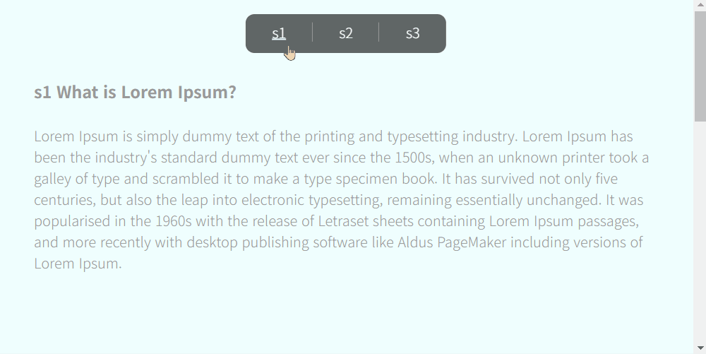

## Index

1. [페이지내 화면 스크롤 이동](#페이지내-화면-스크롤-이동)

<br>

---------------------------------------------------
## 페이지내 화면 스크롤 이동
### 01-scrollToAreaMenu



#### html
```
<header id="scrollToAreaMenu">
  <a href="#s1">s1</a>
  <a href="#s2">s2</a>
  <a href="#s3">s3</a>
</header>

... 

<section id="#s1"> S1 </section>
<section id="#s2"> S2 </section>
<section id="#s3"> S3 </section>
```

#### JS
```
const menuEls = document.querySelectorAll("header#scrollToAreaMenu a");

menuEls.forEach(function(menuEl) {
  menuEl.addEventListener("click", function(e) {
    e.preventDefault();  // 브라우저 기본 이벤트 무력화
    const hrefValue = this.getAttribute('href'); // href의 속성 값을 가져옴
    const targetEl = document.querySelector(hrefValue); // dom 요소 선택
    if (hrefValue && targetEl) {
      window.scrollTo({ 
        top: targetEl.offsetTop, // 해당요소의 위치 값으로
        behavior: 'smooth' // 부드럽게 스크롤
      });
    }
  });
});
```

#### a태그 대신 다른 요소로 작성해도 된다
```
<header id="scrollToAreaMenu">
  <div data-move-screen="#s1">S1</div>
  <div data-move-screen="#s2">S2</div>
  <div data-move-screen="#s3">S3</div>
</header>

<section id="#s1"> S1 </section>
<section id="#s2"> S2 </section>
<section id="#s3"> S3 </section>

...

<script>
const menuEls = document.querySelectorAll("header#scrollToAreaMenu > div");

menuEls.forEach(function(menuEl) {
  menuEl.addEventListener("click", function(e) {
    const dataValue = this.getAttribute('data-move-screen'); // data-move-screen 속성 값을 가져옴
    const targetEl = document.querySelector(dataValue); // dom 요소 선택
    if (dataValue && targetEl) {
      window.scrollTo({ 
        top: targetEl.offsetTop, // 해당요소의 위치 값으로
        behavior: 'smooth' // 부드럽게 스크롤
      });
    }
  });
});
</script>
```
<br>

