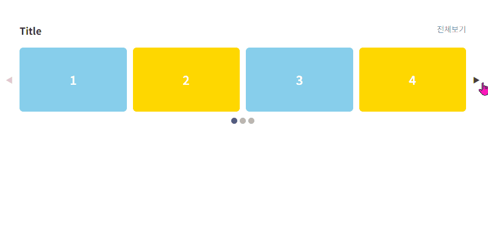
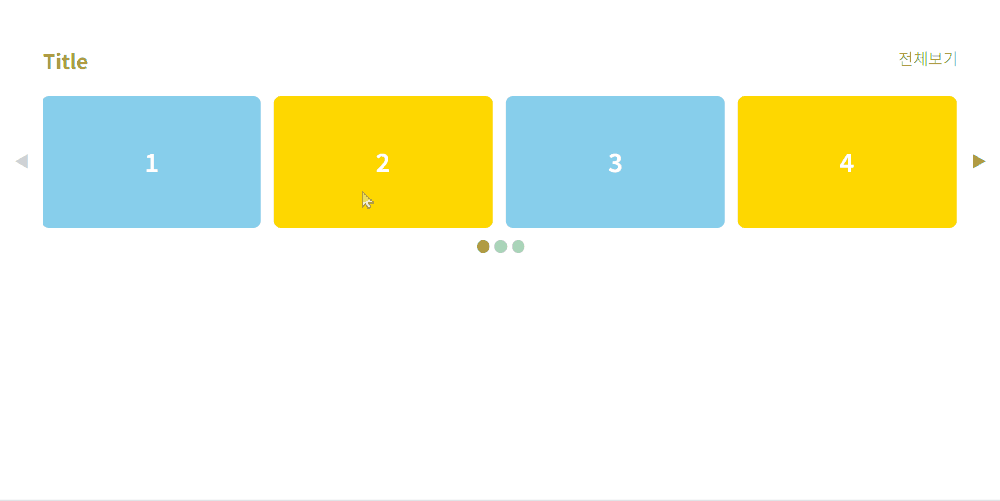

## Index

1. [기본 슬라이드](#1-기본-슬라이드)  
1. [스와이프 슬라이드](#2-스와이프-슬라이드)

<br>

---------------------------------------------------
## 1. 기본 슬라이드
### 01-defaultSlider
- 이전 및 다음 버튼
- 불렛 (클릭 가능)
- 스와이프 없음



#### html
```
<div id="defaultSlider">
  <div class="slider">
    <div class="item-wrap">
      <div class="item">1</div>
      <div class="item">2</div>
      <div class="item">3</div>
      <div class="item">4</div>
      <div class="item">5</div>
      <div class="item">6</div>
      <div class="item">7</div>
      <div class="item">8</div>
      <div class="item">9</div>
    </div>
  </div>
  <div class="btn-prev">◀</div>
  <div class="btn-next">▶</div>
  <div class="pagination"></div>
</div>

```

#### JS
```
/* dom 요소 설정 */
  const mySliderEl = document.querySelector("#defaultSlider");
  const btnPrevEl = mySliderEl.querySelector(".btn-prev");
  const btnNextvEl = mySliderEl.querySelector(".btn-next");
  const sliderEl = mySliderEl.querySelector(".slider");
  const itemWrapEl = mySliderEl.querySelector(".item-wrap");
  const itemEls = mySliderEl.querySelectorAll(".item");
  const paginationEl = mySliderEl.querySelector(".pagination");


  /* 전역 변수 */
  let currentIndex = 0; // 현재 인덱스
  let itemCount = 4; // item 개수
  let itemGap = 10; // item 사이 간격
  let slideCount = Math.ceil(itemEls.length / itemCount) // 슬라이드 개수, currentIndex가 이를 넘어가면 안됨


  /* 초기 설정 */
  let itemCountPercent = 100 / itemCount; // itemEl 너비 구하는데 필요한 값 (dummy)
  let itemGapPx = itemGap - itemGap / itemCount; // itemEl 너비 구하는데 필요한 값(dummy)
  itemEls[0].parentNode.style.gap = `${itemGap}px` // itemEl 간격
  itemEls.forEach(itemEl => {
    itemEl.style.width = `calc(${itemCountPercent}% - ${itemGapPx}px)`; // itemEl Width
  })


  /* 함수 : 자주 사용하니 함수로 만듦 */
  // slide 이동 함수
  function moveSlider(){
    itemWrapEl.style.transition = ".3s"; // 이동할 시간
    itemWrapEl.style.transform = `translateX(calc(${-currentIndex * 100}% - ${currentIndex * itemGap}px))`; 
    // item-wrap 이동, itemEl 간격도 같이 계산
  }

  // 페이지네이션 불렛 setUp
  function setUpBullet(offIndex, onIndex){
    paginationBulletEls[offIndex].classList.remove("active") // 불렛 비활성화
    paginationBulletEls[onIndex].classList.add("active") // 불렛 활성화
  }

  // 이전 및 다음 버튼 setUp
  function setupBtn(){
    if(currentIndex == 0 && slideCount == 1){ // item 개수가 모든 화면에 나올때
      btnPrevEl.classList.remove("active")
      btnNextvEl.classList.remove("active")
    }else if(currentIndex == 0 && slideCount > 1){ // 처음 화면일때
      btnPrevEl.classList.remove("active")
      btnNextvEl.classList.add("active")
    }else if(currentIndex == slideCount-1 && slideCount > 1 ){ // 마지막 화면일때
      btnPrevEl.classList.add("active")
      btnNextvEl.classList.remove("active")
    }else{ // 중간 화면 일때
      btnPrevEl.classList.add("active")
      btnNextvEl.classList.add("active")
    }
  }

  
  /* 페이지네이션 */
  // 페이지네이션 불렛 생성
  for(let i = 0; i < slideCount; i++){
    let paginationBulletEl;
    paginationBulletEl = document.createElement('div');
    paginationBulletEl.classList.add('pagination-bullet');
    // paginationBulletEls.textContent = ""
    paginationEl.appendChild(paginationBulletEl)
  }
  // 페이지네이션 불렛 dom 설정
  let paginationBulletEls = mySliderEl.querySelectorAll(".pagination-bullet")
  paginationBulletEls[0].classList.add("active")

  // 페이지네이션 버튼 설정 및 이동
  paginationBulletEls.forEach((itemEl, index) => {
    itemEl.addEventListener("click", () => {
      setUpBullet(currentIndex, index)
      currentIndex = index;
      moveSlider();
      setupBtn();
    })
  })
  

  /* 버튼 */
  // 버튼 초기 설정
  setupBtn();
  // 버튼 이동
  btnPrevEl.addEventListener("click", () => {
    if(currentIndex > 0 && currentIndex <= slideCount-1){
      setUpBullet(currentIndex, currentIndex-1)
      currentIndex--;
      moveSlider();
      setupBtn()
    }
  })
  btnNextvEl.addEventListener("click", () => {
    if(currentIndex >= 0 && currentIndex < slideCount-1 ){
      setUpBullet(currentIndex, currentIndex+1)
      currentIndex++;
      moveSlider();
      setupBtn()
    }
  })
```

### <br>

---------------------------------------------------
## 2. 스와이프 슬라이드
### 02-swipeSlider
- [기본 슬라이드](#1-기본-슬라이드)에 이어서 제작
  - 이전 및 다음 버튼
  - 불렛 (클릭 가능)
- 스와이프 기능 추가 (드래그 앤 드롭)



#### html
[기본 슬라이드](#1-기본-슬라이드)와 같음

#### JS
[기본 슬라이드](#1-기본-슬라이드)에 이어서 작성
```
/* 스와이프 */
// 스와이프 필요 변수
let startPos = 0; // 스와이프 시작 좌표
let movePos = 0; // 스와이프 이동 좌표
let isSwiping = false; // 스와이프 실행 여부 확인

// 스와이프 관련 함수 : 마우스(PC) 및 터치(Mobile)에서 동시에 동작하므로 함수를 만듦
function handleSwipeStart(e){
  startPos = e.clientX || e.touches[0].clientX;
  if(e.clientX){
    e.preventDefault()
  }
  isSwiping = true;
}

function handleSwipeMove(e){
  if(isSwiping){
    movePos = startPos - (e.clientX || e.touches[0].clientX); 
    // 마우스가 오른쪽 이동하면 movePos가 - (왼쪽으로 이동), 마우스가 왼쪽 이동하면 movePos가 + (오른쪽으로 이동)
    let endMovePos = Math.max(Math.min(movePos, 50), -50);; 
    // 처음 혹은 마지막 슬라이드일때 스와이프 제한 거리
    let translateXValue;
    if(currentIndex == 0 && movePos < 0){
      translateXValue = `calc( ${-currentIndex * 100}% - ${currentIndex * itemGap}px - ${endMovePos}px)`;
    }else if(currentIndex == slideCount-1 && movePos > 0){
      translateXValue = `calc( ${-currentIndex * 100}% - ${currentIndex * itemGap}px - ${endMovePos}px)`;
    }else{
      translateXValue = `calc( ${-currentIndex * 100}% - ${currentIndex * itemGap}px - ${movePos}px)`;
    }
    itemWrapEl.style.transition = 'none';
    itemWrapEl.style.transform = `translateX(${translateXValue})`
  }
}

function handleSwipeEnd(e){
  isSwiping = false;
  let swipePoint = Math.round(sliderEl.offsetWidth / 4) // 슬라이더 너비의 25% 때 스와이핑
  if(Math.abs(movePos) > swipePoint){
    if(movePos < 0 && currentIndex > 0 && currentIndex <= slideCount-1){ 
      // "마우스가 오른쪽으로 이동 && 두번째 슬라이드 ~ 마지막 슬라이드" 는 왼쪽으로 이동
      setUpBullet(currentIndex, currentIndex-1)
      currentIndex--;
    }else if(movePos > 0 && currentIndex >= 0 && currentIndex < slideCount-1){
      // "마우스가 왼쪽으로 이동 && 첫번째 슬라이드 ~ 마지막에서 이전 슬라이드" 는 오른쪽으로 이동
      setUpBullet(currentIndex, currentIndex+1)
      currentIndex++;
    }
  }
  moveSlider();
  setupBtn();
  movePos = 0; // mouseleave 되어도 이동하지 않도록 movePos를 0으로 세팅
}
  // 데스크탑 스와이프
  sliderEl.addEventListener("mousedown", handleSwipeStart);
  sliderEl.addEventListener("mousemove", handleSwipeMove);
  sliderEl.addEventListener("mouseup", handleSwipeEnd);
  sliderEl.addEventListener("mouseleave", handleSwipeEnd);
  
  // 모바일 스와이프
  sliderEl.addEventListener("touchstart", handleSwipeStart);
  sliderEl.addEventListener("touchmove", handleSwipeMove);
  sliderEl.addEventListener("touchend", handleSwipeEnd);
```


