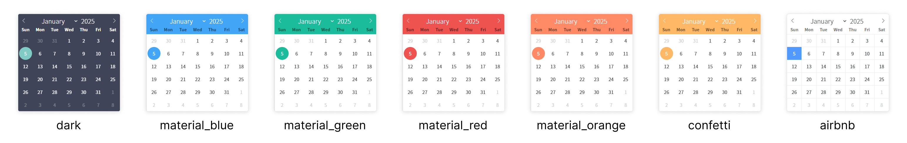

## 소개
- https://flatpickr.js.org/
- 날짜 및 시간 선택 경량 JS 라이브러리
- ```<input type="date">``` 와는 반대로 CSS 커스텀이 가능하다
- JS 로 제작되어 빠르고 가벼우며, 다양한 기능(테마, 시간 선택, 언어 등)을 제공한다
- 모든 브라우저에서 같은 UI와 기능을 제공한다 (```<input type="date">``` 는 Safari 9 이전은 미지원한다)

## 사용 방법
### 1. flatpickr.min.css, flatpickr.js 연결
- CDN
```
<link rel="stylesheet" href="https://cdn.jsdelivr.net/npm/flatpickr/dist/flatpickr.min.css">
<script src="https://cdn.jsdelivr.net/npm/flatpickr"></script>
```

### 2. [HTML] flatpickr 적용할 요소에 아이디명 추가
- div, input 등 다양한 요소에 적용해도 동작 하지만, &lt;input type="text"> 에 적용하는 것을 추천
- 왜 &lt;input type="date">에 적용하지 않는지?
  - 브라우저의 기본 달력 UI를 제거하고 Flatpickr을 적용하기 위해서
  - 기본 달력 UI가 보일수가 있고, 기본 달력 이벤트가 충돌할 수도 있기 때문이다
```
<input type="text" id="아이디명">
```

### 3. [JS] flatpickr 초기화(선언)
```
flatpickr("#아이디명", {
  /* 옵션 : 옵션값, */
});
```

---

## 옵션 정리 (JS)
- https://flatpickr.js.org/options/ 참고
### enableTime (시간 활성화)
- [boolean] : true, false (기본)
### time_24hr (24시간제 표시)
- [boolean] : true, false (기본)
- PM/AM 선택 영역이 사라지고 00 ~ 24 시간으로 표시
### noCalendar (달력 UI 미표시)
- [boolean] : true, false (기본)
  - true : 달력 UI 미표시
  - false : 달력 UI 표시
- 시간만 선택 : ``` {enableTime: true, noCalendar: true} ```
### dateFormat (날짜 형식)
- [string] : "Y-m-d" (기본), "Y-m-d H:i" (시간 활성화 기본)
- 내부 저장용 데이터
- 날짜 형식 (https://flatpickr.js.org/formatting)
  - 예) 2025년 04월 09일 수요일 14시 30분

    |  종류               |  Full             |  Short    |
    | :--                 | :--               |  :--      |
    |  년                 |  Y (2025)         |   y (25)  |
    |  월 (string)        |  F (April)        |   M (Arp) |
    |  월 (num)           |   m (04)           |  n (4)   |
    |  일                 |  d (09, 두자리)     |   j(9)    |
    |  요일 (string)       |   I (Wednesday)   | D (Wed)  |
    |  12 시간 (0~12)      |   h (02, 두자리)   | g (2)     |
    |  24 시간 (0~24)      |   H (14, 두자리)   | G (14)   |
    |  오전(AM) / 오후(PM)  |   K (PM)          |
    |  분                   |   i (30, 두자리)  |
    |  초                   |   s (0)          |

    - "Y-m-d H:i" = "2025-04-09 14:30"
    - "F. m. Y" = "April. 04. 2025"
### altInput, altFormat (입력 필드 형식)
- 입력 필드에 표시되는 날짜 형식
- altInput 옵션 : [boolean] true, false (기본)
- altFormat 옵션 : [string] "Fj, Y" (기본), ```{ altInput : true }``` 로 설정되어 있어야 함
### defaultDate (초기값)
- [null] (기본)
- [string]
  - dateFormat 형식에 맞춘 날짜
  - "today" : flatpickr 에서 제공하는 오늘 날짜
- [ "" ] : 빈 문자열
  - ```<input type="text" placeholder="날짜 입력">``` 이렇게 placeholder를 이용할 수 있다
- [new Date()] : JS 날짜 객체
  - new Date() : 오늘
  - new Date(YYYY, M, D)
    - YYYY : 4자리 숫자 년도 (2025)
    - M : 월 (0 ~ 11), 0부터 시작 (0 = 1월)
    - D : 일 (1 ~ 31), 1부터 시작 (1 = 1일)
  - new Date(2025, 0, 5) = 2025년 1월 5일
- enableTime (시간)을 설정하여 시간 초기값 설정 가능
### minDate, maxDate (최소&최대 날짜 지정)
- [null] (기본)
- defaultDate 옵션값과 같음 (dateFormat 형식 문자열, "today", Date 객체)
- [함수] ```new Date( ).fp_incr(n)```
  - 오늘 날짜 기준으로 n일 전/후의 날짜
  - flatpickr의 내장함수
  - new Date()에만 사용 가능 (new Date(2025,1,1)에 사용하면 에러 발생)
- enableTime (시간)을 설정하여 시간도 최소&최대 설정 가능
### disable (비활성화)
- [배열]
  - 특정 날짜 : [ "날짜" ]
    ```
    disable: ["2025-01-30", "2025-02-21", new Date(2025, 4, 9) ],
    ```
  - 범위 날짜 : [ {form : "날짜", to : "날짜"}, {form : "날짜", to : "날짜"} ]
    ```
    disable: [
        { from: "2025-04-01", to: "2025-05-30"},
        { from: "2025-09-01", to: "2025-12-31"}
    ],
    ```
  - 함수 이용 : [ function(){ ~ } ]
    ``` 
    disable: [ // 일, 월요일 비활성화
        function(date) {return (date.getDay() === 0 || date.getDay() === 6);}
    ],
    ```
### enable (날짜 활성화)
- [배열] : 옵션값은 disable와 같음
- disable의 반대
### mode (날짜 모드)
- [string] "single" (기본), "multiple", "range"
- "multiple"
  - 여러 날짜 다중 선택
  - 초기값 설정 : ```defaultDate: ["2025-01-15", "2025-01-20"]``` → 2025-01-15, 2025-01-20 초기값
- "range"
  - 날짜 범위 선택 "2025-01-01 to 2025-01-31"
  - 중간에 disable로 설정된 날짜가 있다면 해당 날짜는 선택할 수 없다
  - 초기값 설정 : ```defaultDate: ["2025-01-15", "2025-01-20"]``` → 2025-01-15에서 2025-01-20 까지 날짜 범위가 설정된 초기값
### conjunction (다중 선택 구분자)
- ```{mode : "multiple"}``` 일때 사용 가능
- [string] : 구분자 문자열
  ```{ mode: "multiple", conjunction: " and " }``` → "2025-01-14 and 2025-02-14" 반환
### inline (달력 UI 열림 여부)
- [boolean] : true, false (기본)
- true 설정시 달력 UI가 열린 상태가 된다
### weekNumbers (주 index)
- [boolean] : true, false (기본)
- true 설정시 좌측에 1월 1일부터 주 index가 표시된다
### wrap (외부 요소 사용 여부)
- [boolean] : true, false (기본)
- true 설정시 여러 요소로 이벤트 제어가 가능하다
- HTML 요소의 속성으로 설정한다
  - data-input : 날짜를 입력 받을 필드 요소
  - data-toggle : 달력 UI를 열고 닫고 할 수 있는 토글 버튼
  - data-open : 달력 UI를 열 수 있는 버튼
  - data-close : 달력 UI를 닫을 수 있는 버튼
```
<!-- HTML -->
<div class="flatpickr">
  <input type="text" data-input>
  <a data-toggle> 토글 </a>
  <a data-clear> 삭제 </a>
  <a data-open> 오픈 </a>
  <a data-close> 닫기 </a>
</div>

//JS
flatpickr(".flatpickr", {wrap: true});
```

---

## 추가 옵션
- flatpickr.min.css, flatpickr.js 와 함께 다른 파일(모듈)을 추가 연결하여 사용할 수 있는 옵션
### 로컬라이징 (현지화)
- 달력은 언어에 맞게 세팅할 수 있다 (한국 : ko)
- flatpickr.js 선언 후 연결해야 한다
- CDN (언어 파일 연결)
```
<script src="https://npmcdn.com/flatpickr/dist/l10n/ko.js"></script>
```
- JS (locale 옵션 설정)
```
flatpickr(".flatpickr", {
  locale : "ko"
});
```
### 테마
- 여러 CSS 테마를 선택하여 적용할 수 있다
- flatpickr.min.css 선언 후 연결해야 한다 (연결만 하면 바로 적용됨)
- 테마 이름 : dark, material_blue, material_green, material_red, material_orange, confetti, airbnb


- CDN (CSS 테마 파일 연결)
```
<link rel="stylesheet" type="text/css" href="https://npmcdn.com/flatpickr/dist/themes/테마이름.css">
```

---

## 옵션 템플릿
```
flatpickr(".flatpickr", {
  enableTime : false,         // 시간 활성화
  time_24hr : false,          // 24시간 표시
  noCalendar : false,         // 달력 UI 미표시
  dateFormat : "Y-m-d H:i",   // 데이터 포맷 (날짜 형식)
  altInput : false,           // 입력 필드 형식 표현
  altFormat : "Fj, Y",        // 입력 필드 날짜 형식, {altInput : true}로 되어 있어야 한다
  defaultDate : null,         // 초기값
  minDate : null,             // 시작 날짜
  maxDate : null,             // 종료 날짜
  disable : [],               // 비활성화
  enable : undefined,         // 활성화
  mode : "single",            // 모드 "multiple", "range"
  conjunction : null,         // 다중 선택("multiple") 모드 구분자
  inline : false,             // 달력 UI 열림 여부
  weekNumbers : false,        // 주 index 활성화
  wrap : false,               // 외부 요소 사용 여부 (data-input, data-toggle, data-open, data-close)
  locale : null,              // 현지화
});
```

---

## 사용자 이벤트
```
  onChange: function(selectedDates, dateStr, instance) {
    // 실행 함수
  }
```
### 이벤트 & 훅
- onChange : 날짜를 선택 및 변경 될때 트리거(발생)
- onReady : flatpickr 가 준비상태가 되면 트리거 (초기 한번만 실행)
- onOpen & onClose : 달력 UI가 오픈/닫힐 시 트리거
- onMonthChange & onYearChange : 날짜가 월/년 이 선택 및 변경 될때 트리거
### 이벤트 핸들러 (이벤트 발생시 실행되는 함수)
```
function(selectedDates, dateStr, instance) { ... }
```
- 사용자 이벤트 동작시 함수가 실행되고, 이 함수는 3개의 인수를 받는다
  - selectedDates : 객체 상태로 날짜 반환
  - dateStr : 문자열 상태로 상태로 날짜 반환
  - instance : 다양한 메서드와 속성을 포함한 flatpickr객체 반환
